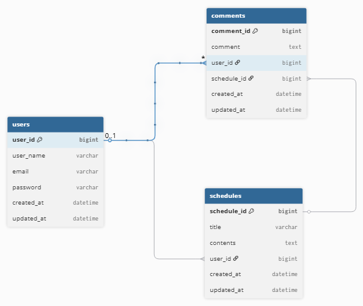

# 일정 관리 앱 - Develop

## ERD

<details>
<summary>ERD</summary>



</details>

## API 명세서

<details>
<summary>API 명세서</summary>

## 인증/인가 API

<details>
<summary>인증/인가 API</summary>

## 회원가입 API

<details>
<summary>회원가입 API</summary>

## 🔹 기본 정보

- **Method** : `POST`
- **URL** : `/register`
- **설명** : 새로운 유저를 생성합니다.

## 🔹 Request

### Headers

```
Content-Type: application/json
```

<br>

### Body

```json
{
  "userName": "김유하",
  "email": "devdong1231@gmail.com",
  "password": "qwer123"
}
```

| 필드명      | 타입     | 필수 | 설명   |
|----------|--------|----|------|
| userName | String | O  | 유저명  |
| email    | String | O  | 이메일  |
| password | String | O  | 비멀번호 |

<br>

## 🔹 Response

#### ✅ 성공 - 201 Created

```json
{
  "userId": 1
}
```

| 필드명    | 타입   | 필수 | 설명        |
|--------|------|----|-----------|
| userId | Long | O  | 유저 고유 식별자 |

#### ❌ 실패 - 409 Conflict

```json
{
  "status": 409,
  "message": "이미 존재하는 이메일입니다."
}
```

</details>

## 로그인 API

<details>
<summary>로그인 API</summary>

## 🔹 기본 정보

- **Method** : `POST`
- **URL** : `/login`
- **설명** : 기존에 등록되어 있는 유저로 로그인을 합니다.

## 🔹 Request

### Headers

```
Content-Type: application/json
Set-Cookie: JSESSIONID={sessionId}
```

<br>

### Body

```json
{
  "email": "devdong1231@gmail.com",
  "password": "qwer123"
}
```

| 필드명      | 타입     | 필수 | 설명   |
|----------|--------|----|------|
| email    | String | O  | 이메일  |
| password | String | O  | 비밀번호 |

<br>

## 🔹 Response

#### ✅ 성공 - 200 OK

```json
{
  "userId": 1,
  "email": "devdong1231@gmail.com"
}
```

| 필드명    | 타입     | 필수 | 설명        |
|--------|--------|----|-----------|
| userId | Long   | O  | 유저 고유 식별자 |
| email  | String | O  | 이메일       |

#### ❌ 실패 - 400 Bad Request

```json
{
  "status": 400,
  "message": "이메일 또는 비밀번호가 일치하지 않습니다."
}
```

</details>

## 로그아웃 API

<details>
<summary>로그아웃 API</summary>

## 🔹 기본 정보

- **Method** : `POST`
- **URL** : `/logout`
- **설명** : 로그인된 사용자의 세션을 무효화하여 로그아웃합니다.

## 🔹 Request

### Headers

```
Cookie: JSESSIONID={sessionId}
```

## 🔹 Response

#### ✅ 성공 - 204 No Content

</details>

</details>

## 일정 API

<details>
<summary>일정 CRUD</summary>

## 일정 생성 API

<details>

<summary>일정 생성 API</summary>

## 🔹 기본 정보

- **Method** : `POST`
- **URL** : `/schedules`
- **설명** : 새로운 일정을 생성합니다.

## 🔹 Request

### Headers

```text
Content-Type: application/json
Cookie: JSESSIONID={sessionId}
```

<br>

### Body

```json
{
  "title": "점심 시간",
  "contents": "오후 1시부터 오후 2시까지 점심 시간"
}
```

| 필드명      | 타입     | 필수 | 설명    |
|----------|--------|----|-------|
| title    | String | O  | 할일 제목 |
| contents | String | O  | 할일 내용 |

<br>

## 🔹 Response

#### ✅ 성공 - 201 Created

```json
{
  "scheduleId": 1,
  "title": "점심 시간",
  "contents": "오후 1시부터 오후 2시까지 점심 시간",
  "userId": 1,
  "createdAt": "2026-04-18T16:30.96822",
  "updatedAt": "2026-04-18T16:30.96822"
}
```

| 필드명        | 타입            | 필수 | 설명        |
|------------|---------------|----|-----------|
| scheduleId | Long          | O  | 고유 식별자    |
| title      | String        | O  | 할일 제목     |
| contents   | String        | O  | 할일 내용     |
| userId     | Long          | O  | 유저 고유 식별자 |
| createdAt  | LocalDateTime | O  | 생성한 날짜    |
| updatedAt  | LocalDateTime | O  | 수정한 날짜    |

<br>

#### ❌ 실패 - 400 Bad Request

<details>
<summary>응답 예시</summary>

```json
{
  "status": 400,
  "message": "제목은 20자 이내로 입력해주세요."
}
```

```json
{
  "status": 400,
  "message": "제목은 필수 입니다."
}
```

```json
{
  "status": 400,
  "message": "내용은 50자 이내로 입력해주세요."
}
```

```json
{
  "status": 400,
  "message": "내용은 필수 입니다."
}
```

</details>

#### ❌ 실패 - 404 Not Found

```json
{
  "status": 404,
  "message": "존재하지 않는 유저입니다."
}
```

</details>

## 일정 단건 조회 API

<details>
<summary>일정 단건 조회 API</summary>

## 🔹 기본 정보

- **Method** : `GET`
- **URL** : `/schedules/{scheduleId}`
- **설명** : 특정한 일정을 단건 조회합니다.

<br>

## 🔹 Path Variable

| 변수명        | 타입   | 설명        |
|------------|------|-----------|
| scheduleId | Long | 일정 고유 식별자 |

### 요청 예시

```
GET /schedules/1
```

<br>

## 🔹 Response

#### ✅ 성공 - 200 OK

```json
{
  "scheduleId": 1,
  "title": "점심 시간",
  "contents": "오후 1시부터 오후 2시까지 점심 시간",
  "userId": 1,
  "createdAt": "2026-04-18T16:30.96822",
  "updatedAt": "2026-04-18T16:30.96822"
}
```

| 필드명        | 타입            | 필수 | 설명        |
|------------|---------------|----|-----------|
| scheduleId | Long          | O  | 일정 고유 식별자 |
| title      | String        | O  | 할일 제목     |
| contents   | String        | O  | 할일 내용     |
| userId     | Long          | O  | 유저 고유 식별자 |
| createdAt  | LocalDateTime | O  | 생성한 날짜    |
| updatedAt  | LocalDateTime | O  | 수정한 날짜    |

<br>

#### ❌ 실패 - 404 Not Found

```json
{
  "status": 404,
  "message": "존재하지 않는 일정입니다."
}
```

</details>

## 일정 전체 조회 API

<details>
<summary>일정 전체 조회 API</summary>

## 🔹 기본 정보

- **Method** : `GET`
- **URL** : `/schedules`
- **설명** : 전체 일정을 조회합니다.

<br>

## 🔹 Response

#### ✅ 성공 - 200 OK

```json
[
  {
    "scheduleId": 1,
    "title": "점심 시간",
    "contents": "오후 1시부터 오후 2시까지 점심 시간",
    "userId": 1,
    "createdAt": "2026-04-18T16:30.96822",
    "updatedAt": "2026-04-18T16:30.96822"
  },
  {
    "scheduleId": 2,
    "title": "저녁 시간",
    "contents": "오후 6시부터 오후 7시까지 점심 시간",
    "userId": 2,
    "createdAt": "2026-04-18T16:30.96822",
    "updatedAt": "2026-04-18T16:30.96822"
  }
]
```

| 필드명        | 타입            | 필수 | 설명        |
|------------|---------------|----|-----------|
| scheduleId | Long          | O  | 일정 고유 식별자 |
| title      | String        | O  | 할일 제목     |
| contents   | String        | O  | 할일 내용     |
| userId     | Long          | O  | 유저 고유 식별자 |
| createdAt  | LocalDateTime | O  | 생성한 날짜    |
| updatedAt  | LocalDateTime | O  | 수정한 날짜    |

<br>

#### ❌ 실패 - 500 Internal Server Error

```json
{
  "status": 500,
  "message": "서버 내부에서 오류가 발생했습니다."
}
```

</details>

## 일정 수정 API

<details>

<summary>일정 수정 API</summary>

## 🔹 기본 정보

- **Method** : `PATCH`
- **URL** : `/schedules/{scheduleId}`
- **설명** : 선택한 일정의 정보를 수정합니다.

<br>

## 🔹 Path Variable

| 변수명        | 타입   | 설명        |
|------------|------|-----------|
| scheduleId | Long | 일정 고유 식별자 |

### 요청 예시

```
PATCH /schedules/1
```

<br>

## 🔹 Request

### Headers

```
Content-Type: application/json
Cookie: JSESSIONID={sessionId}
```

### Body

```json
{
  "title": "점심 시간",
  "contents": "오후 1시 반 부터 오후 2시 반 까지"
}
```

| 필드명      | 타입     | 필수 | 설명    |
|----------|--------|----|-------|
| title    | String | O  | 할일 제목 |
| contents | String | O  | 할일 내용 |

<br>

## 🔹 Response

#### ✅ 성공 - 200 OK

```json
{
  "scheduleId": 1,
  "title": "점심 시간",
  "contents": "오후 1시 반 부터 오후 2시 반 까지",
  "userId": 1,
  "createdAt": "2026-04-18T16:30.96822",
  "updatedAt": "2026-04-18T16:30.96822"
}
```

| 필드명        | 타입            | 필수 | 설명        |
|------------|---------------|----|-----------|
| scheduleId | Long          | O  | 일정 고유 식별자 |
| title      | String        | O  | 일정 제목     |
| contents   | String        | O  | 일정 내용     |
| userId     | Long          | O  | 유저 고유 식별자 |
| createdAt  | LocalDateTime | O  | 생성한 날짜    |
| updatedAt  | LocalDateTime | O  | 수정한 날짜    |

#### ❌ 실패 - 400 Bad Request

<details>
<summary>응답 예시</summary>

```json
{
  "status": 400,
  "message": "제목은 20자 이내로 입력해주세요."
}
```

```json
{
  "status": 400,
  "message": "제목은 필수 입니다."
}
```

```json
{
  "status": 400,
  "message": "내용은 50자 이내로 입력해주세요."
}
```

```json
{
  "status": 400,
  "message": "내용은 필수 입니다."
}
```

</details>

### ❌ 실패 - 403 Forbidden

```json
{
  "status": 403,
  "message": "권한이 없습니다."
}
```

#### ❌ 실패 - 404 Not Found

```json
{
  "status": 404,
  "message": "존재하지 않는 일정입니다."
}
```

</details>

## 일정 삭제 API

<details>

<summary>일정 삭제 API</summary>

## 🔹 기본 정보

- **Method** : `DELETE`
- **URL** : `/schedules/{scheduleId}`
- **설명** : 특정 일정을 삭제합니다.

<br>

### 🔹 Path Variable

| 변수명        | 타입   | 설명        |
|------------|------|-----------|
| scheduleId | Long | 일정 고유 식별자 |

### 요청 예시

```
DELETE /schedules/1
```

<br>

## 🔹 Request

### Header

```
Cookie: JSESSIONID={sessionId}
```

## 🔹 Response

#### ✅ 성공 - 204 No Content

### ❌ 실패 - 403 Forbidden

```json
{
  "status": 403,
  "message": "권한이 없습니다."
}
```

#### ❌ 실패 - 404 Not Found

```json
{
  "status": 404,
  "message": "해당 일정을 찾을 수 없습니다"
}
```

</details>

</details>

## 유저 API

<details>
<summary>유저 CRUD</summary>

## 유저 단건 조회 API

<details>
<summary>유저 단건 조회 API</summary>

## 🔹 기본 정보

- **Method** : `GET`
- **URL** : `/users/{userId}`
- **설명** : 특정한 유저을 단건 조회합니다.

<br>

## 🔹 Path Variable

| 변수명    | 타입   | 설명     |
|--------|------|--------|
| userId | Long | 고유 식별자 |

### 요청 예시

```
GET /users/1
```

<br>

## 🔹 Response

#### ✅ 성공 - 200 OK

```json
{
  "userId": 1,
  "userName": "김유하",
  "email": "devdong1231@gmail.com",
  "createdAt": "2026-04-18T16:30.96822",
  "updatedAt": "2026-04-18T16:30.96822"
}
```

| 필드명       | 타입            | 필수 | 설명     |
|-----------|---------------|----|--------|
| userId    | Long          | O  | 고유 식별자 |
| userName  | String        | O  | 유저명    |
| email     | String        | O  | 이메일    |
| createdAt | LocalDateTime | O  | 생성한 날짜 |
| updatedAt | LocalDateTime | O  | 수정한 날짜 |

<br>

#### ❌ 실패 - 404 Not Found

```json
{
  "status": 404,
  "message": "존재하지 않는 유저입니다."
}
```

</details>

## 유저 전체 조회 API

<details>

<summary>유저 전체 조회 API</summary>

## 🔹 기본 정보

- **Method** : `GET`
- **URL** : `/users`
- **설명** : 전체 유저를 조회합니다.

<br>

## 🔹 Response

#### ✅ 성공 - 200 OK

```json
[
  {
    "userId": 1,
    "userName": "김유하",
    "email": "devdong1231@gmail.com",
    "createdAt": "2026-04-18T16:30.96822",
    "updatedAt": "2026-04-18T16:30.96822"
  },
  {
    "userId": 2,
    "userName": "홍길동",
    "email": "gildong1231@gmail.com",
    "createdAt": "2026-04-18T16:30.96822",
    "updatedAt": "2026-04-18T16:30.96822"
  }
]
```

| 필드명       | 타입            | 필수 | 설명     |
|-----------|---------------|----|--------|
| userId    | Long          | O  | 고유 식별자 |
| userName  | String        | O  | 유저명    |
| email     | String        | O  | 이메일    |
| createdAt | LocalDateTime | O  | 생성한 날짜 |
| updatedAt | LocalDateTime | O  | 수정한 날짜 |

<br>

#### ❌ 실패 - 500 Internal Server Error

```json
{
  "status": 500,
  "message": "서버 내부에서 오류가 발생했습니다."
}
```

</details>

## 유저 수정 API

<details>

<summary>유저 수정 API</summary>

## 🔹 기본 정보

- **Method** : `PATCH`
- **URL** : `/users/{userId}`
- **설명** : 선택한 유저의 정보를 수정합니다.

<br>

## 🔹 Path Variable

| 필드명    | 타입   | 필수 | 설명        |
|--------|------|----|-----------|
| userId | Long | O  | 유저 고유 식별자 |

### 요청 예시

```
PATCH /users/1
```

<br>

## 🔹 Request

### Headers

```
Content-Type: application/json
Cookie: JSESSIONID={sessionId}
```

### Body

```json
{
  "userName": "김유하",
  "email": "devdong1231@gmail.com"
}
```

| 필드명      | 타입     | 필수 | 설명  |
|----------|--------|----|-----|
| userName | String | O  | 유저명 |
| email    | String | O  | 이메일 |

<br>

## 🔹 Response

#### ✅ 성공 - 200 OK

```json
{
  "userId": 1,
  "userName": "김유하",
  "email": "devdong1231@gmail.com",
  "createdAt": "2026-04-18T16:30.96822",
  "updatedAt": "2026-04-18T16:30.96822"
}
```

| 필드명       | 타입            | 필수 | 설명     |
|-----------|---------------|----|--------|
| userId    | Long          | O  | 고유 식별자 |
| userName  | String        | O  | 유저명    |
| email     | String        | O  | 이메일    |
| createdAt | LocalDateTime | O  | 생성한 날짜 |
| updatedAt | LocalDateTime | O  | 수정한 날짜 |

#### ❌ 실패 - 400 Bad Request

<details>
<summary>응답 예시</summary>

```json
{
  "status": 400,
  "message": "이름은 한글 1~5자여야 합니다."
}
```

```json
{
  "status": 400,
  "message": "이메일은 필수입니다."
}
```

</details>


</details>

## 유저 삭제 API

<details>

<summary>유저 삭제 API</summary>

## 🔹 기본 정보

- **Method** : `DELETE`
- **URL** : `/users/{userId}`
- **설명** : 특정 유저를 삭제합니다.

<br>

## 🔹 Path Variable

| 변수명    | 타입   | 설명     |
|--------|------|--------|
| userId | Long | 고유 식별자 |

### 요청 예시

```
DELETE /users/1
```

<br>

## 🔹 Response

#### ✅ 성공 - 204 No Content

#### ❌ 실패 - 404 Not Found

```json
{
  "status": 404,
  "message": "존재하지 않는 유저입니다."
}
```

</details>

</details>

## 댓글 API

<details>
<summary>댓글 CRUD</summary>

## 댓글 생성 API

<details>
<summary>댓글 생성 API</summary>

## 🔹 기본 정보

- **Method** : `POST`
- **URL** : `/schedules/{scheduleId}/comments`
- **설명** : 새로운 댓글을 등록합니다.

<br>

## 🔹 Request

### Headers

```
Content-Type: application/json
Cookie: JSESSIONID={sessionId}
```

<br>

### Body

```json
{
  "comments": "점심 맛있겠네요"
}
```

| 필드명      | 타입     | 필수 | 설명    |
|----------|--------|----|-------|
| comments | String | O  | 댓글 내용 |

<br>

## 🔹 Response

#### ✅ 성공 - 201 Created

```json
{
  "commentId": 1,
  "comments": "점심 맛있겠네요",
  "createdAt": "2026-04-18T16:30.12345",
  "updatedAt": "2026-04-18T16:30.12345"
}
```

| 필드명       | 타입            | 필수 | 설명        |
|-----------|---------------|----|-----------|
| commentId | Long          | O  | 댓글 고유 식별자 |
| comments  | String        | O  | 댓글 내용     |
| createdAt | LocalDateTime | O  | 생성한 날짜    |
| updatedAt | LocalDateTime | O  | 수정한 날짜    |

<br>

#### ❌ 실패 - 400 Bad Request

<details>
<summary>응답 예시</summary>

```json
{
  "status": 400,
  "message": "내용은 필수 입니다."
}
```

```json
{
  "status": 400,
  "message": "내용은 50자 이내로 입력해주세요."
}
```

</details>

#### ❌ 실패 - 404 Not Found

<details>
<summary>응답 예시</summary>

```json
{
  "status": 404,
  "message": "존재하지 않는 일정입니다."
}
```

```json
{
  "status": 404,
  "message": "존재하지 않는 유저입니다."
}
```

</details>

</details>

## 댓글 전체 조회 API

<details>
<summary>댓글 전체 조회 API</summary>

## 🔹 기본 정보

- **Method** : `GET`
- **URL** : `/schedules/{scheduleId}/comments`
- **설명** : 전체 댓글을 조회합니다.

<br>

## 🔹 Response

### Body

#### ✅ 성공 - 200 OK

```json
[
  {
    "commentId": 2,
    "comments": "배고프다",
    "userName": "김유하",
    "createdAt": "2026-04-08T08:40",
    "updatedAt": "2026-04-08T08:40"
  },
  {
    "commentId": 1,
    "comments": "점심 맛있겠네요",
    "userName": "김유하",
    "createdAt": "2026-04-08T08:40",
    "updatedAt": "2026-04-08T16:40"
  }
]
```

| 필드명       | 타입            | 필수 | 설명        |
|-----------|---------------|----|-----------|
| commentId | Long          | O  | 댓글 고유 식별자 |
| comments  | String        | O  | 댓글 내용     |
| userName  | String        | O  | 작성자명      |
| createdAt | LocalDateTime | O  | 생성한 날짜    |
| updatedAt | LocalDateTime | O  | 수정한 날짜    |

### ❌ 실패 - 500 Internal Server Error

```json
{
  "status": 500,
  "message": "서버 오류가 발생했습니다."
}
```

</details>

## 댓글 수정 API

<details>
<summary>댓글 수정 API</summary>

## 🔹 기본 정보

- **Method** : `PATCH`
- **URL** : `/schedules/{scheduleId}/comments/{commentId}`
- **설명** : 특정 댓글을 수정합니다.

<br>

## 🔹 Path Variable

| 변수명        | 타입   | 설명        |
|------------|------|-----------|
| scheduleId | Long | 일정 고유 식별자 |
| commentId  | Long | 댓글 고유 식별자 |

### 요청 예시

```
PATCH /schedules/1/comments/1
```

<br>

## 🔹 Request

### Headers

```
Content-Type: application/json
Cookie: JSESSIONID={sessionId}
```

### Body

```json
{
  "comments": "짱짱굿"
}
```

| 필드명      | 타입     | 필수 | 설명    |
|----------|--------|----|-------|
| comments | String | O  | 댓글 내용 |

<br>

## 🔹 Response

### ✅ 성공 - 200 OK

```json
{
  "commentId": 1,
  "comments": "짱짱굿",
  "userName": "김유하",
  "createdAt": "2026-04-18T16:30",
  "updatedAt": "2026-04-18T17:30"
}
```

| 필드명       | 타입            | 필수 | 설명     |
|-----------|---------------|----|--------|
| commentId | Long          | O  | 고유 식별자 |
| comments  | String        | O  | 댓글 내용  |
| userName  | String        | O  | 작성자명   |
| createdAt | LocalDateTime | O  | 생성한 날짜 |
| updatedAt | LocalDateTime | O  | 수정한 날짜 |

### ❌ 실패 - 400 Bad Request

<details>
<summary>응답 예시</summary>

```json
{
  "status": 400,
  "message": "내용은 50자 이내로 입력해주세요."
}
```

```json
{
  "status": 400,
  "message": "내용은 필수입니다."
}
```

</details>

### ❌ 실패 - 403 Forbidden

```json
{
  "status": 403,
  "message": "권한이 없습니다."
}
```

### ❌ 실패 - 404 Not Found

```json
{
  "status": 404,
  "message": "존재하지 않는 일정입니다."
}
```

</details>

## 댓글 삭제 API

<details>
<summary>명세서</summary>

## 🔹 기본 정보

- **Method** : `DELETE`
- **URL** : `/schedules/{scheduleId}/comments/{commentId}`
- **설명** : 선택한 댓글을 삭제합니다.

<br>

## 🔹 Path Variable

| 변수명        | 타입   | 설명        |
|------------|------|-----------|
| scheduleId | Long | 일정 고유 식별자 |
| commentId  | Long | 댓글 고유 식별자 |

### 요청 예시

```
DELETE /schedules/1/comments/1
```

<br>

## 🔹 Request

### Headers

```
Content-Type: application/json
Cookie: JSESSIONID={sessionId}
```

## 🔹 Response

### ✅ 성공 - 204 No Content

### ❌ 실패 - 404 Not Found

```json
{
  "status": 404,
  "message": "존재하지 않는 일정입니다."
}
```

### ❌ 실패 - 403 Forbidden

```json
{
  "status": 403,
  "message": "권한이 없습니다."
}
```

</details>

</details>

</details>